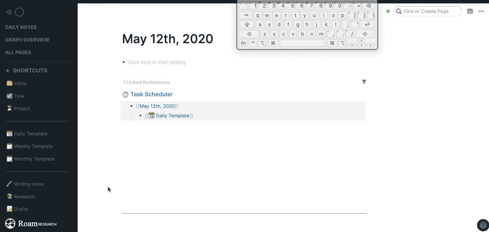

Note: I haven't worked on this, because I now use the vim keybindings [roam-toolkit](https://github.com/roam-unofficial/roam-toolkit) instead:

https://www.youtube.com/watch?v=ZxtT05CjOyo&feature=youtu.be

# vimmyroam

The goal of this project is to be able to use Roam with only a keyboard.

## Installation

1. Install [tampermonkey](https://www.tampermonkey.net/)
2. Create a new tampermonkey script
3. Paste the contents of [vimmyroam.js](https://raw.githubusercontent.com/tntmarket/vimmyroam/master/vimmyroam.js) into the tampermonkey editor

Disclaimer: Does not include warranty

## Key Bindings

| Command | Hotkey |
| ------------- | ------------- |
| Scroll up | `k` |
| Scroll down | `j` |
| Page up | `u` |
| Page down | `d` |
| Scroll to top | `g`, `g` |
| Scroll to bottom | `G` |
| Focus main panel | `h` |
| Focus sidebar panel | `l` |
| Click something | `f` |
| Edit block | `e` |
| Unfocus | `Esc` |

### Click Something

Hit "f" to see various hovering hint bubbles. Type the hint next to an element to simulate clicking it. "e" shows only hints for blocks.

* Green edits a block
* Yellow clicks on a link
* Purple clicks on a button

Holding shift as you type the hint opens it in the side bar.

## Developing

To develop a tampermonkey script using your IDE, use the `// @require file:///path/to/userscript.user.js` [trick](https://stackoverflow.com/questions/41212558/develop-tampermonkey-scripts-in-a-real-ide-with-automatic-deployment-to-openuser)

## Feature Wishlist

| Command | Notes |
| ------------- | ------------- |
| [Spatial Navigation](https://github.com/tntmarket/vimmyroam/issues/5) | Like mouse keys, but snaps to blocks. [Vivaldi](https://help.vivaldi.com/article/spatial-navigation/) has this |
| Extract page | Notion has this |
| Rename link + page, without going to page itself | Like "rename" refactoring in IDEs, or rename via the sidebar |
| Navigate seamlessly between pages in sidebar | Up/down should focus the next page, instead of dead-ending on the current page |
| Focus title | Dedicated shortcut for focusing the title |
| Hide unreachable hints after keystrokes | None |
 
# Other Projects

* [roam-toolkit](https://github.com/roam-unofficial/roam-toolkit) is being actively developed - Has fuzzy date creation, spaced repetition helpers
* [palashkaria's roam-modifiers](https://github.com/palashkaria/roam-modifiers) - has a cool live preview tooltip
* [Ryan Guill's Roam Experiments](https://greasyfork.org/en/scripts/402699-ryan-guill-s-roam-experiments-roamresearch-com) - has colored highlighting

## Surfing Keys

I learned after creating this that [Surfing Keys works in Roam](https://www.youtube.com/watch?time_continue=2&v=ezNK8zXe0UE) with some extra configuration. Integration is under investigation ([#1](https://github.com/tntmarket/vimmyroam/issues/1)).

## Why doesn't Vimium Work?

Vimium doesn't work because Roam blocks don't actually show the textarea until you click on it. vimmyroam simulates actual mouse clicks/hovers to get the text area to show up.
